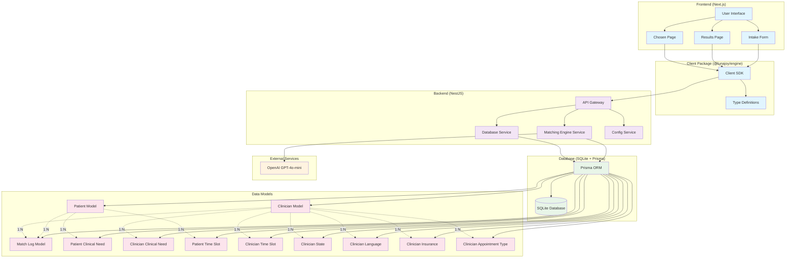

# LunaJoy Architecture

## System Overview

LunaJoy is a clinician matching application that helps patients find the right mental health professionals based on their preferences and needs.

## Architecture Diagram

## Component Details

### Frontend Components

- **IntakeForm**: Collects patient preferences and requirements
- **Results Page**: Displays ranked clinician matches with swipe functionality
- **Chosen Page**: Confirmation page after selecting a clinician

### Backend Services

- **Matching Engine Service**: Core algorithm for scoring and ranking clinicians
- **Database Service**: Handles data access and filtering
- **Config Service**: Manages application configuration

### Data Flow

1. Patient fills out intake form with preferences
2. Frontend sends data to backend via client SDK
3. Matching engine filters and scores clinicians
4. Results are ranked and returned to frontend
5. Patient can swipe through matches and select preferred clinician
6. AI explanation is generated for top match using OpenAI

### Key Features

- **Real-time Matching**: Instant clinician recommendations
- **AI-Powered Explanations**: GPT-4 generates personalized match explanations
- **Responsive Design**: Mobile-first interface with swipe gestures
- **Type Safety**: Full TypeScript implementation across all layers
- **Scalable Architecture**: Modular design with clear separation of concerns
